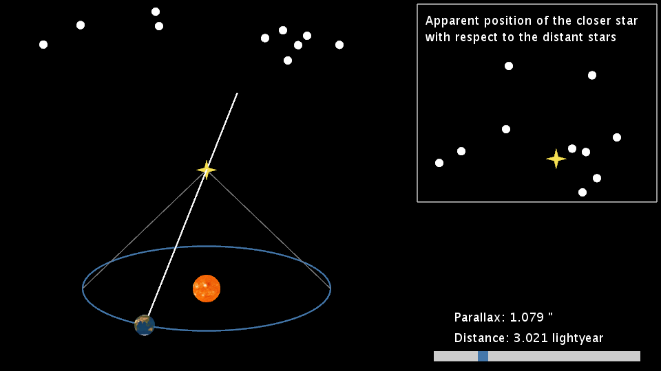

# ParallaxDemo

Simple demonstration of the concept of the annual parallax of stars.

## Explanation and motivation for this Processing sketch

This processing sketch implements an animation that provides a very basic
illustration of the concept of the annual parallax of a star. The screen-shot
below shows what the animation looks like.

The left part of the image shows the earth going around the sun and how the
line of sight between the earth and a nearby star (yellow star symbol)
varies, leading to an apparent annual change of position with respect to the
more distant stars.

The box to the top right shows what the 3D situation on the left looks like,
projected on the sky. The star goes round in circles with respect to the
background stars, a reflection of the motion of the earth around the sun.

At the bottom right a scroll-bar can be seen that can be used to adjust the
distance to the star (in light year). The value of the distance and
corresponding parallax angle (in arcsecond) are shown above the scroll-bar.

The animation is a recreation in the [Processing](https://processing.org)
language of a Flash animation created by ESA. The latter is no longer
available for download and the Flash format is not supported anymore, hence
the effort to recreate the parallax demonstration in Processing.

The animation is intended for use during presentations; to provide a simple
but effective demonstration of the concept of the annual parallax of a star.
From within the Processing development environment the sketch can be
exported as a stand-alone executable (with the Java Runtime Environment
included), which can be used on any platform (famous last words...).

You can set the language for the text in the animation at the top of the [ParallaxDemo](./ParallaxDemo.pde) code.

To run the sketch in full-screen mode uncomment the relevant line in the
`setup { ... }` code block.

Save a screen-shot of the running sketch by pressing the right mouse button.

#### Resources

The texture image for the earth is from the examples folder in the
Processing distribution (TextureSphere example). The texture image for the
sun is from
<https://commons.wikimedia.org/wiki/File:Map_of_the_full_sun.jpg>.
